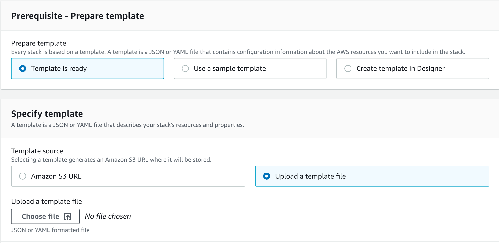
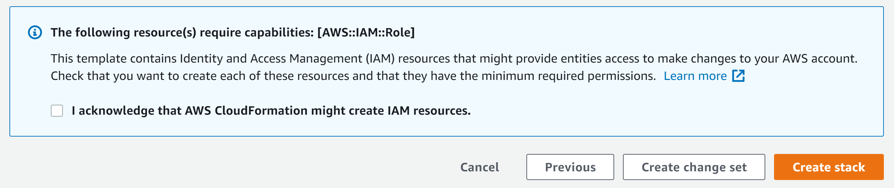
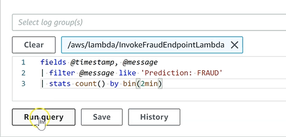
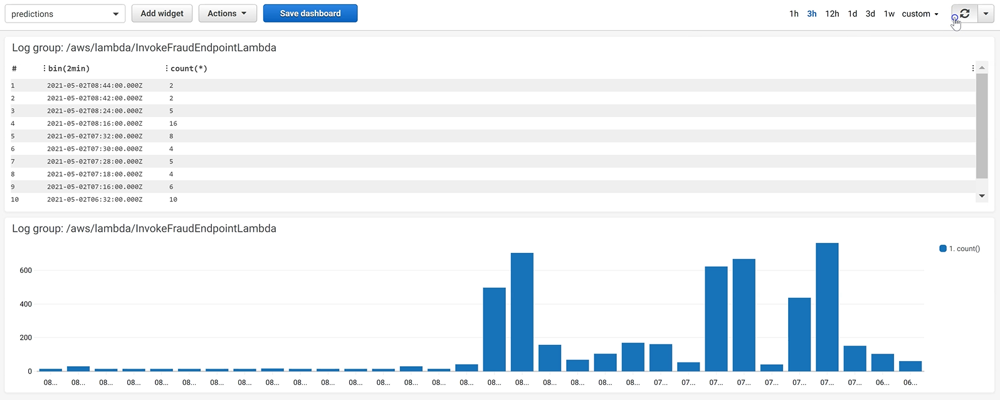

# Trends in the Marketplace 2021-Fraud Detection-Team7

# Introduction:  
   
According to Forbes, fraud costs merchants an estimated $190 billion each year1. To combat this, several real time machine learning products have been developed over the years. One of these products is Amazon Web Services, which offers an end to end pipeline solution entirely under one architecture. This example is based on the template created by pmhargis-aws2. In our example, we will create an artificial representation of real time fraud detection. First, we will create an synthetic credit card fraud data set. This will then be stored in an Amazon S3 bucket which will become the historical training set for our machine learning model. The model will be trained using Amazon SageMaker which will then later be used to predict the streamed in data to provide real time fraud detection. The real time data itself will be streamed in using Amazon Kinesis as well as AWS Lambda. Finally the output will be streamed to AWS Cloudwatch where the logs can be analyzed. This template is just an example to familiarize you with the potential for AWS. Because AWS was designed with scalability in mind, this example could be scaled up to handle thousands of transactions a second.

# Implementation:
1. Follow this link to access AWS CloudFormation: https://us-east-2.console.aws.amazon.com/cloudformation/home?region=us-east-2#/stacks/create/template 
    In case of errors, simply open up your aws console and navigate to CloudFormation. In CloudFormation select the "Create Stack" option.
    
2. In the create stack prompt, select upload template. The template is available in this repository.

3. Continue clicking next while leaving the default settings in place. If prompted for a stack name, you will need to repeat it in notebook number one. Continue along until you are prompted to check, "I acknowledge that AWS CloudFormation might create IAM resources". Check this box and create the stack. This may take several minutes.

4. Use the search bar to navigate to SageMaker. On the lefthand column click notebook instances and then "open in jupyter".

5. The notebooks created are to be run sequentially. Notebook 5 is a cleanup notebook that should not be run until you are finished. Due to an error that occurs using the template provided by pmhargis-aws, we have provided a modified template to be more accomodating. This does however limit the allocated processing power from what the original template expected. As a result, we recommend replacing notebooks 2 and 3 with the ones provided in the repository as they have also been modified, to work more efficiently with the new template limitations.

# Cloud Watch Analysis

6. At the end of notebook 4, you are provided with a link to monitor your results in Amazon Cloudwatch. Navigate to the insights tab on the lefthand column. CloudWatch offers a built in querying solution to create basic insights of your streaming events. While not as capable as Amazon QuickSight, these basic results can be an important first step in monitoring the health of your system as well as your implemented solution. An example query and its output can be viewed below.

To generate the query, run

Query output

7. Once you are done with the tutorial, run notebook 5. In addition you will need to once again navigate to CloudFormation and delete the stack to avoid being charged.

# Links to Project

Link to Project Video: https://youtu.be/3A_sdIarexU 

This project repository is created in partial fulfillment of the requirements for the Big Data Analytics course offered by the Master of Science in Business Analytics program at the Carlson School of Management, University of Minnesota.

# Citations:

credit/ sources - 
1. https://www.forbes.com/sites/haydnshaughnessy/2011/03/24/solving-the-190-billion-annual-fraud-scam-more-on-jumio/?sh=5584dea4390e 

2. https://github.com/aws-samples/amazon-sagemaker-feature-store-streaming-aggregation
